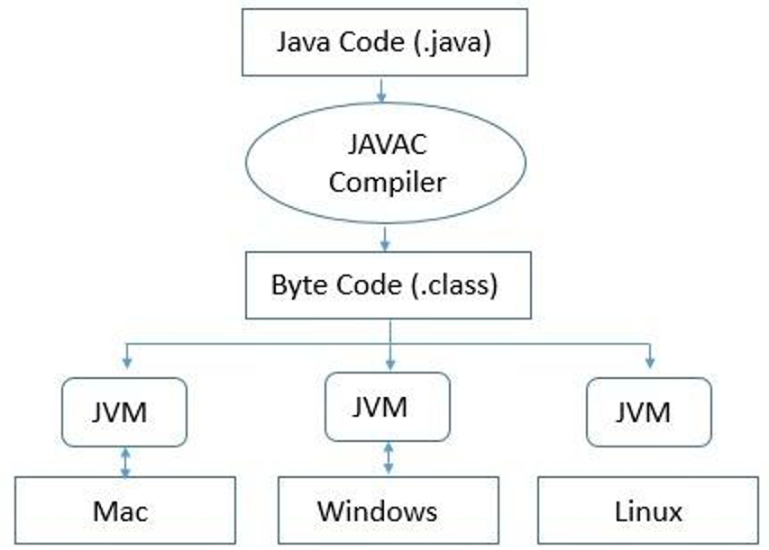

## Módulo 01

### Linguagem Java

#### História
##### Criado na década de **90** por **James Gosling**   na empresa Sun Microsystems
##### O objetivo do Java quando criado era para ser   usado em **dispositivos embarcados (TVs)**
##### A equipe da época viu que o Java tinha muito   potencial e avançou no desenvolvimento
##### Em **2008** foi comprada pela empresa Oracle

#### Compilação
##### É o processo de **conversão** de **linguagem textual**   para **linguagem de máquina**
##### Linguagem **textual** são entendidas por **humanos**
##### Linguagem de **máquina** são entendidas por **computadores** 
##### Faz uso de um software chamado **compilador**
##### Imagem
###### 

#### Java Virtual Machine (JVM)
##### É um **software** que faz a leitura dos bytecodes   e converte para **instruções de código**   considerando o **Sistema Operacional** específico
##### Pois cada Sistema Operacional tem suas **características**   e isso precisa ser considerado ao **executar o software**
##### Figura da JVM

#### Referências
##### Documentação da Linguagem <a href="https://docs.oracle.com/javase/8/docs/api/index.html?help-doc.html" target="_blank">Java</a>
##### Livro <a href="https://drive.google.com/file/d/1cbL3z3R31e3iVh0Lq6MmBjj59ff7iH1p/view?usp=drive_link" target="_blank">Java como Programar 8° Edição</a>

##### Vídeo aulas Loiane Gronner <a href="https://www.youtube.com/playlist?list=PLGxZ4Rq3BOBq0KXHsp5J3PxyFaBIXVs3r" target="_blank">Youtube</a>

#### Aplicações do Java

##### Softwares Desktop
###### Supermercados
###### Farmácias
###### Gestão de Pessoas

##### Aplicativos Android

##### Desenvolvimento de Serviços (API)

#### Ambiente de Desenvolvimento

##### NetBeans IDE
###### Parte visual para construção telas **muito boa**,   pois consegue criar telas fazendo **drag and drop**   dos elementos
###### Código fica um pouco **poluído** de comentários   gerados pela IDE

##### Eclipse
##### Não tem a parte visual, precisa fazer   manualmente **(muito trabalhoso)**
###### Código fonte fica **limpo**

##### Visual Studio Code
##### Código fonte fica **limpo** e tem muita produtividade   quando usado para praticar a **lógica**.

#### **Atividade**

### Fundamentos

#### Algoritmo
##### Entender o problema
##### Entrada de dados
##### Processamento
##### Saída

#### Compilando
###### javac
###### .class
###### Porque não executar   **java Hello.class** ?
###### O **.class** não é um programa executável,   é um **bytecode** que a **JVM** interpreta   **e procura a classe com nome do arquivo**

#### Imprimindo informações
##### <a href="https://github.com/olimpiodev-tec/java/blob/main/fundamentos/Hello.java" target="_blank">System</a>
###### out
###### err
###### print
###### println
##### Formatação
###### <a href="https://github.com/olimpiodev-tec/java/blob/main/fundamentos/Formata.java" target="_blank">printf</a>
###### <a href="https://github.com/olimpiodev-tec/java/blob/main/fundamentos/Informacao.java" target="_blank">format</a>
##### <a href="https://github.com/olimpiodev-tec/java/blob/main/fundamentos/Argumentos.java" target="_blank">Argumentos</a>

#### <a href="https://github.com/olimpiodev-tec/java/blob/main/fundamentos/Informacao.java" target="_blank">Tipos de dados</a>
##### String
##### int
##### double
##### float
##### boolean
##### char
##### Porque o tipo **String** é  diferente dos **outros**? 

#### Entrada de dados
##### <a href="https://github.com/olimpiodev-tec/java/blob/main/fundamentos/Saida.java" target="_blank">Scanner</a>

#### Constantes
##### <a href="https://github.com/olimpiodev-tec/java/blob/main/fundamentos/Figuras.java" target="_blank">final</a>

#### Operações Matemáticas
##### <a href="https://github.com/olimpiodev-tec/java/blob/main/fundamentos/Media.java" target="_blank">Soma Subtração Multiplicação</a>
##### <a href="https://github.com/olimpiodev-tec/java/blob/main/fundamentos/Divide.java" target="_blank">Divisão</a>
##### <a href="https://github.com/olimpiodev-tec/java/blob/main/fundamentos/Impar.java" target="_blank">Resto da divisão</a>
##### <a href="https://docs.oracle.com/javase/8/docs/api/java/lang/Math.html" target="_blank">Biblioteca Math</a>
###### <a href="https://github.com/olimpiodev-tec/java/blob/main/fundamentos/Exponencial.java" target="_blank">pow</a>
###### <a href="https://github.com/olimpiodev-tec/java/blob/main/fundamentos/Sorteio.java" target="_blank">round</a>
###### <a href="https://github.com/olimpiodev-tec/java/blob/main/fundamentos/Raiz.java" target="_blank">sqrt</a>
###### <a href="https://github.com/olimpiodev-tec/java/blob/main/fundamentos/Nota.java" target="_blank">random</a>

#### <a href="https://github.com/olimpiodev-tec/java/blob/main/fundamentos/atividades/readme.md" target="_blank">Atividades</a>

#### Estrutura de Decisão

##### if else

##### switch case

#### Estrutura de Repetição

##### for

##### while

#### Vetores

#### **Atividades**

### Programação Orientada à Objetos

#### Classe

#### Objeto

#### Encapsulamento

#### Herança

#### Polimorfismo

#### Interfaces

### Aplicações Desktop

#### Elementos

##### Button

##### Label

##### Input

##### Table

#### Projeto Calculadora

#### Projeto TodoList

#### Projeto Totem

## Módulo 02

### Definição

### Histórico

### Características

### Arquitetura

### Ambiente de Desenvolvimento

#### Instalação

#### Configuração

#### Dependências

#### Recursos de interface

## Módulo 03

### Layout de tela

#### Estrutura

##### XML tela

##### Strings

##### XML Resource

#### Tipos

##### Linear Layout

##### ListView

### Controle dos elementos de tela

##### Eventos

###### Click

###### Change

##### Exceções

###### try catch

###### try catch finally

### Navegação entre telas

#### Intent

#### Passagem de parâmetros

#### Ciclo de vida da Activity

## Módulo 04

### Projeto Calculadora

### Projeto Busca CEP
